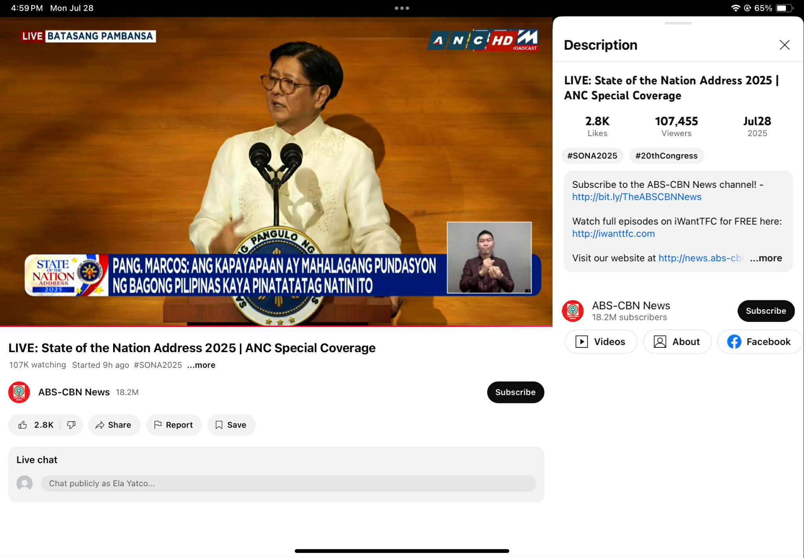

# Take on SONA July 2025 of Pres. Ferdinand R. Marcos Jr.
### By Rafaela Yatco, 9-Beryllium 

## Key Points I Found Interesting

I found several points from President Marcos’ speech interesting. These were his points on **economic growth**, **expanded healthcare access**, **access to free wifi**, and other **major infrastructure projects**.

- President Marcos Jr. highlighted a **low inflation rate of 1.4%** and an **unemployment rate of around 4%**.
- He announced **free public college education and technical-vocational programs**, aimed at creating more employed Filipinos.
- **Healthcare reforms** were also emphasized. In his speech, the President stated that all DOH hospitals would implement **zero-balance billing**, especially for patients with  illnesses such as cancer, kidney disease, and heart conditions.
- He promised that **12,000 public schools without internet** would be connected by the end of the year and **SIM cards** would be distributed.
- Lastly, major infrastructure projects such as the **Bataan-Cavite Interlink Bridge**. 

## Key Points I Found Weird or Lacking

In the SONA as well, I found some things to be weird or unclarified for me.

- The **₱20-per-kilo rice** program was good for consumers, but it raised concerns from farmer groups, as people said it would be an unsustainable price for them. 
- The speech **ignored politically sensitive topics** such as:
  - The **impeachment case against the Vice President**,
  - The **ICC investigation** against former President Duterte, and
  - The **West Philippine Sea dispute**.
- Lastly, despite promoting **renewable energy** via his proposed programs, the President **did not address environmental issues**, which was disappointing considering climate disasters affect our nation. 

## Reflection

The fourth State of the Nation Address by President Ferdinand Marcos Jr. gave updates on the state of our country and his plans for the remaining years of his term. The speech centered around a clear vision focused on **economic and social development**. The administration's emphasized on **improving healthcare and education** and addressing the rising cost of living. Promises such as expanded **PhilHealth benefits** and a crackdown on **corruption in flood-control projects** were proposed solutions to issues. He also introduced initiatives in **renewable energy** and **sports development** which had a goal to flourish energy and culture in the country.

However, the State of the Nation Address also felt a bit “missing” in terms of coverage of national issues. The SONA **failed to mention** several **political, and environmental concerns** affecting the country. While the speech was very hopeful for the vision of the Philippines, addressing other urgent problems. Overall, the SONA laid out a plan, but I hope the President’s next speech will **dive deeper into the root causes** of the nation’s problems.

## Final Sentence

**A nation’s progress should be measured on how it affects the people, not only by the speeches given.**

